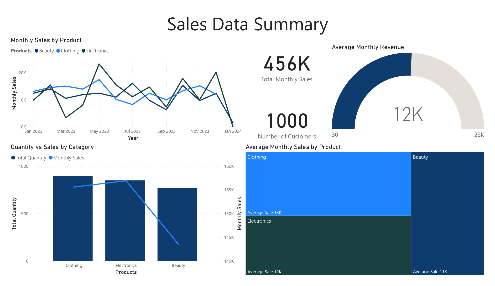

# Retail Sales Analysis – SQL, Power BI & ML Lesson Learned

## Dataset
`Date, CustomerID, Age, Gender, ProductCategory, Quantity, UnitPrice, TotalPrice, RecordID, Gender_Code, year, month, quarter`

---

## 1) SQL: Cleaning & Feature Prep
File: `retail_sales_cleaning.sql`

- Removed duplicates & null values.
- Encoded `Gender` → `Gender_Code`.
- Extracted `Year`, `Month`, `Quarter` from `Date`.
- Created aggregated `sales_summary` table for Power BI.
- Exported:
  - `sales_summary.csv` → for dashboard.
  - `retail_sales_ml_ready.csv` → for ML.

---

## 2) Power BI: Dashboard
File: `sales_dashboard.pbix`

**Page — Sales Performance Overview**
- KPIs: Monthly Sales, Quantity Sold, Unique Customers.
- Visuals:
  - Monthly Sales Trends.
  - Sales by Product Category.
  - Unique Customers Trend.
- Slicers: Product Category, Month, Year.

_Screenshot_

---

## 3) Python ML: Modeling Attempt
Notebook: `total_price_prediction.ipynb`

- Loaded `retail_sales_ml_ready.csv`.
- Dropped non-predictive IDs (`Date`, `CustomerID`, `Gender`).
- Tested multiple regressors (LR, KNN, DT, RF, GBR, XGB).
- Evaluated with **R² Score**.

**Key Finding:**  
`UnitPrice` and `Quantity` perfectly determine `TotalPrice` (`TotalPrice = UnitPrice × Quantity`) → **data leakage**.  
Other features contributed almost no signal → **noise**.

---

## Conclusion
The ML model failed due to leakage and noise — proving that some business metrics are better explained with **formulas** or **dashboards** rather than prediction models.  

**Main strengths of this project:**
- **SQL** — Data cleaning, preprocessing, aggregation.
- **Power BI** — Interactive dashboard for sales insights.
- **Python** — Feature analysis, understanding failure causes.

---

## Repository
- retail_sales_cleaning.sql
- sales_summary.csv
- retail_sales_original.csv
- retail_sales_ml_ready.csv
- sales_dashboard.pbix
- sales_dashboard.jpg
- sales_price_prediction.ipynb
- total_price_prediction.joblib

---
